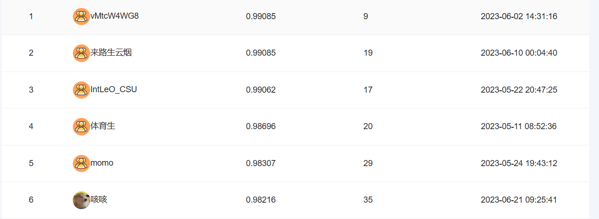
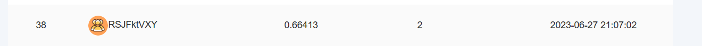

# Coggle 30 Days of ML（23年6月）  

同时两场，苹果疾病和卫星图像变化

| 任务名称                            | 难度/分值 | 完成情况 |
| :---------------------------------- | :-------- | -------- |
| 任务1：两个赛题数据可视化           | 低/1      | :star:   |
| 任务2：苹果病害数据加载与数据增强   | 中/2      |     :star:      |
| 任务3：苹果病害模型训练与预测       | 中/2      |     :star:      |
| 任务4：苹果病害模型优化与多折训练   | 高/3      |      :star:    |
| 任务5：建筑物检测数据加载与数据增强 | 高/2      |     :star:      |
| 任务6：建筑物模型训练与预测       | 中/2      |      :star:    |
| 任务7：建筑物模型优化与多折训练   | 高/3      |    :star:      |

## 排名结果

精度0.98216 排名6

Miou0.66413 排民36

## 个人体会

《粮食和经济作物病害图像识别挑战赛》作为细粒度分类任务，数据集中的标注错误无可避免，需要避免使用硬标签做loss。同时也使用图像hash删除了一些重复与多重语义的图像，和第一名差距不算大，也不打算继续提交了。

《卫星图像变化》感觉标签也画的不准，但是时间不是特别充足，就提交了一次，有机会再多次提交。

本次六月学习任务主要在代码规范和多折交叉验证上有进步，有收获。
