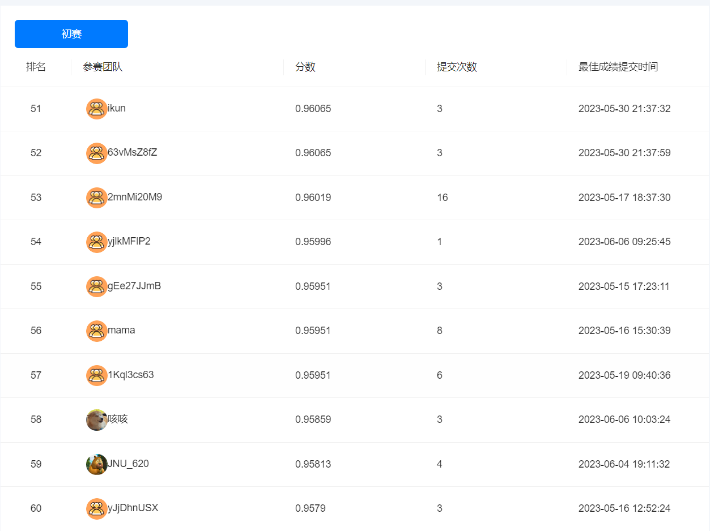

# Coggle 30 Days of ML（23年6月）  

同时两场，苹果疾病和卫星图像变化

| 任务名称                            | 难度/分值 | 完成情况 |
| :---------------------------------- | :-------- | -------- |
| 任务1：两个赛题数据可视化           | 低/1      | :star:   |
| 任务2：苹果病害数据加载与数据增强   | 中/2      |     :star:      |
| 任务3：苹果病害模型训练与预测       | 中/2      |     :star:      |
| 任务4：苹果病害模型优化与多折训练   | 高/3      |          |
| 任务5：建筑物检测数据加载与数据增强 | 高/2      |     :star:      |
| 任务6：建筑物模型训练与预测       | 中/2      |          |
| 任务7：建筑物模型优化与多折训练   | 高/3      |          |

## 排名结果

精度0.95859 排名58

